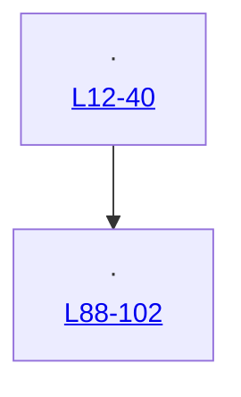
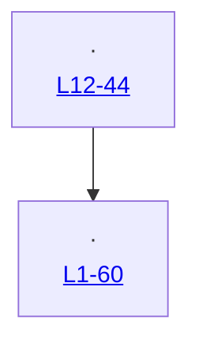

# Flow file: template

Template for `rolling-wave-planning`. Lives at `flows/<n>.<f>-<slug>.md`, one per feature.

**This is the human's map for reviewing the PR.** It answers "what did this change, and where do I look", in two diagrams, before they read a line of the diff.

## Four rules

1. **Two diagrams.** The **before** diagram is drawn at the feature `open` gate, pinned to the base SHA, by a `light`-tier `flow-explorer` dispatch. The **after** diagram is drawn when the PR is ready, pinned to the head SHA. **Skip the before diagram, and say so in one line, when the flow does not exist yet.**
2. **Written once, never edited.** Not re-pinned, not corrected, not updated when a later commit moves a line. A later feature that changes the same flow writes **its own file**; this one becomes history.
3. **Every node names a file and a function or symbol, and carries a permalink.** The symbol does not go stale. The permalink is pinned at the SHA in the header and therefore never rots:
   `https://github.com/<owner>/<repo>/blob/<sha>/<path>#L<a>-L<b>`
4. **Details live in code comments, not here.** If the flow needs a paragraph of explanation, the explanation belongs next to the code. This file says what talks to what, in what order.

## Template: copy verbatim, replacing bracketed text

```markdown
# Flow <n>.<f>: <Feature title>

Feature: `agent/<n>-<item>/<f>-<slug>.md` · PR: <url>
Before pinned at `<base sha>` · After pinned at `<head sha>`

## Before

<One line: what the flow does today. Or, when there is nothing to diagram:
"No before flow: this feature adds <surface> where nothing existed.">



## After

<One line: what the flow does now, and the one sentence a reviewer needs to hold in mind.>



## What changed

Three bullets at most, each naming the node it happened at.

- <node>: <what is different>
```

## Drawing it

- **One diagram per flow**, not one per file. If the feature changes two genuinely separate flows, write two before/after pairs under two headings in the same file.
- **Node label shape**: `<file> · <symbol>` on the first line, the permalink on the second. Keep labels short; the link carries the detail.
- **Edge labels say what crosses**, not how: a payload, an event, a call, a row. "calls" on every edge is noise.
- **Include the boundary nodes** the feature does not own but does depend on (the route handler, the table, the external call), so the reviewer sees where the change stops.
- Flowchart for a call path, `sequenceDiagram` when ordering across actors is the point. Nothing else.

## Red flags

- A flow file edited after it was written.
- A node with a line number but no symbol name.
- A node with no permalink, or a permalink to a branch rather than a SHA.
- A prose section explaining what the diagram already shows.
- A second flow file for a feature. One file, two diagrams.
- A feature opened with no flow file and no line saying the before flow does not exist yet.
