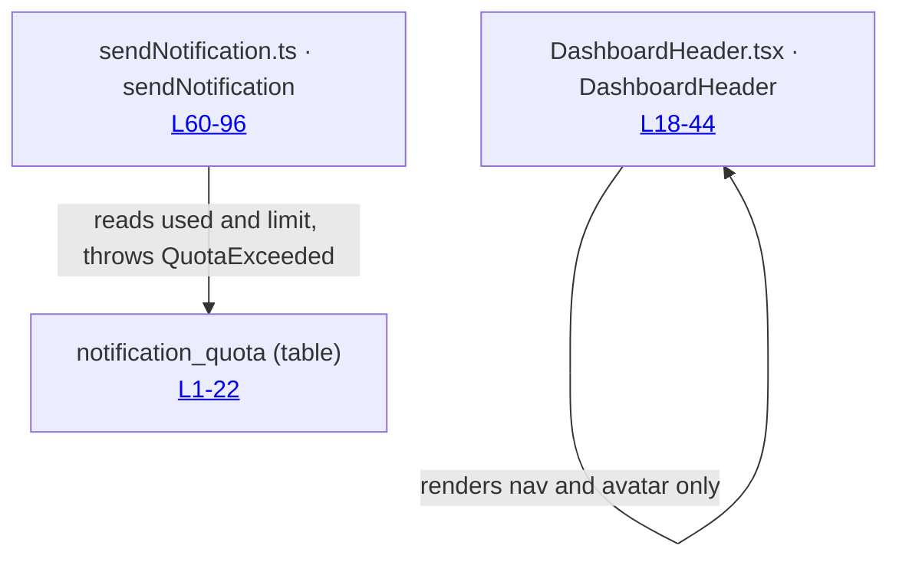
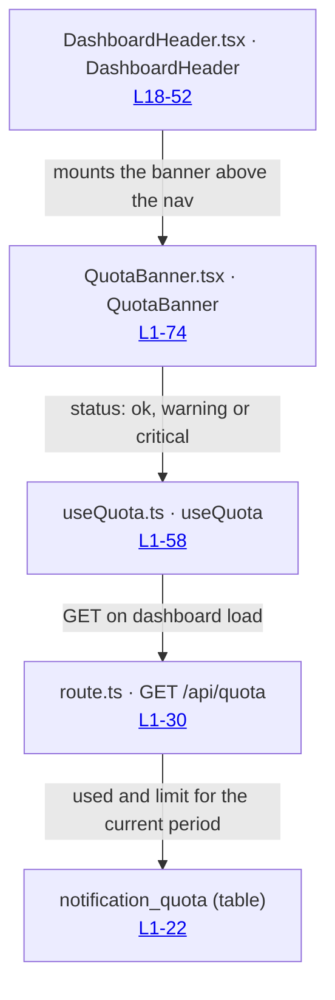

# Flow 4.1: Quota banner

Feature: `agent/4-quota/1-quota-banner.md` · PR: https://example.invalid/notifications/pull/214
Before pinned at `a71c30d4` · After pinned at `5c8ad713`

## Before

The dashboard header renders with no quota awareness; the only reader of `notification_quota` is
the send path, which fails closed once the limit is reached.

## After

The header asks a new hook for a quota status on every dashboard load, and renders one of three
states. Nothing on the send path changed: the banner is a second reader of the same row.

## What changed

- `DashboardHeader`: mounts `QuotaBanner`, which renders nothing at `ok`.
- `useQuota`: new hook, the only new read of `notification_quota` from the dashboard.
- `GET /api/quota`: new route, returns the period row and nothing else.
