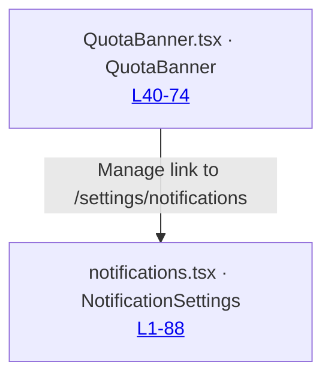
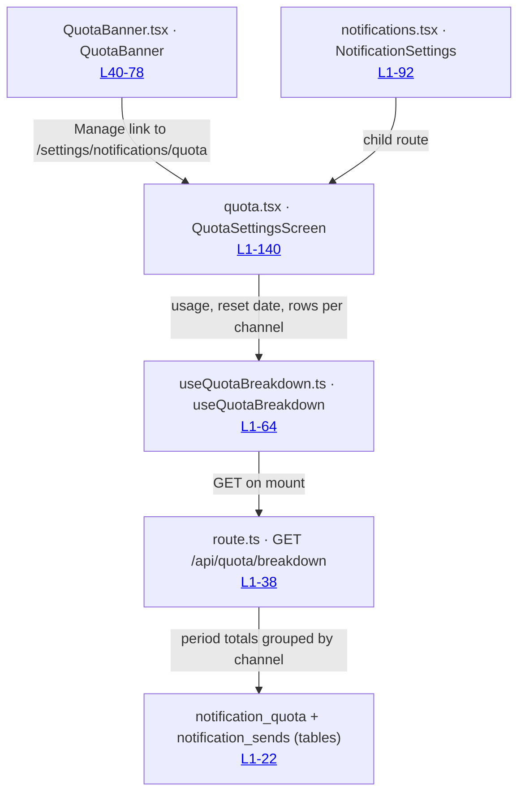

# Flow 4.2: Quota settings screen

Feature: `agent/4-quota/2-quota-settings.md` · PR: https://example.invalid/notifications/pull/221
Before pinned at `c4e0f119` · After pinned at `9b2d5af0`

## Before

Settings has a Notifications section with per-channel opt-in toggles from item 2 and no quota
detail anywhere. The banner's Manage affordance points at this section and stops there.

## After

A new child route owns the quota detail and its own per-channel query. The banner's Manage link
now lands on it, and the opt-in screen is untouched.

## What changed

- `QuotaBanner`: the Manage link target moves from the section to the new child route.
- `QuotaSettingsScreen`: new screen, owns loading, error and empty states.
- `GET /api/quota/breakdown`: new route, the only per-channel aggregation in the dashboard.
